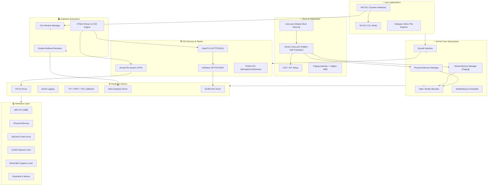

# 🏗️ Retro-OS System Architecture

This flowchart illustrates the core architecture of Retro-OS, showing how the various subsystems—from the low-level bootloader to high-level GUI applications—interact with each other.

### 🔍 Architectural Highlights:

1.  **Higher-Half Design**: The kernel lives at `0xC0000000`, separating kernel space from user space, which simplifies memory protection and system call handling.
2.  **Modular Drivers**: Hardware interaction is abstracted. For example, the **VFS** allows the OS to interact with files without caring whether they are on a FAT16 drive or a network-mounted resource.
3.  **Modern Web Capability**: Unlike many hobbyist OSes, Retro-OS includes a **TLS (mbedTLS)** layer combined with **ALPN/SNI** support, allowing it to communicate with modern HTTPS servers.
4.  **Double Buffering**: All graphics are rendered to an off-screen buffer (`back_buffer`) and swapped to the hardware (`screen_buffer`) in a single pass to eliminate flicker.
5.  **POSIX Layer**: Provides a bridge for standard C/C++ applications, supporting semaphores, message queues, and standard file operations.
