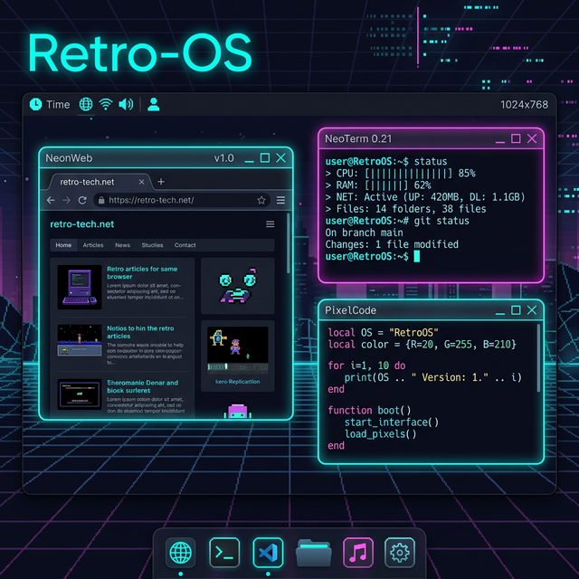
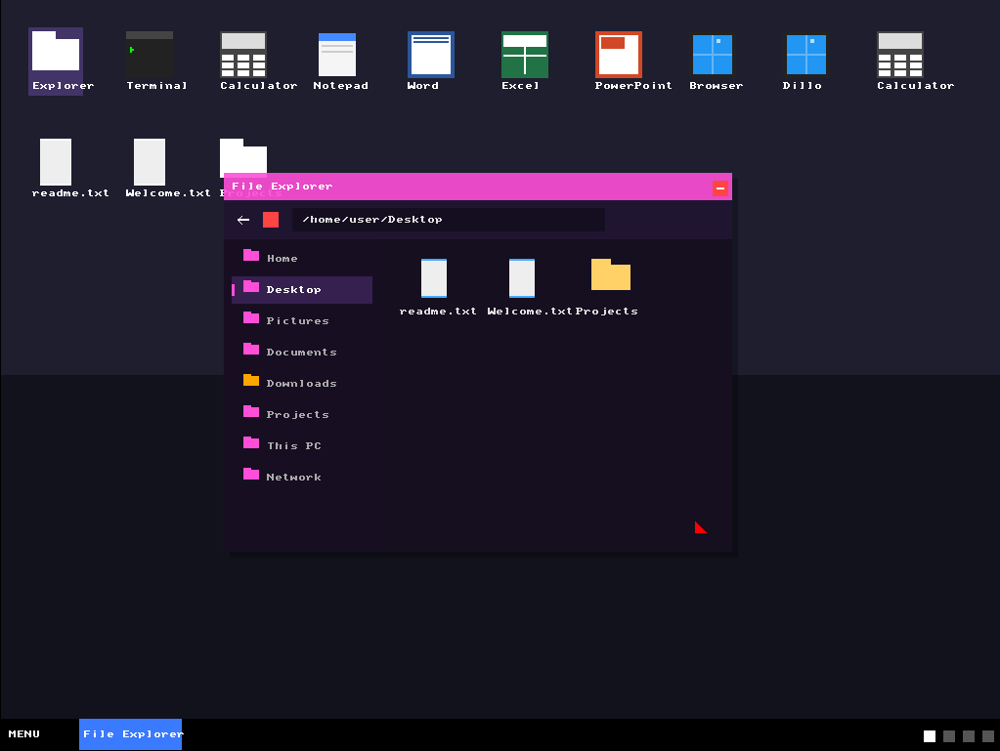
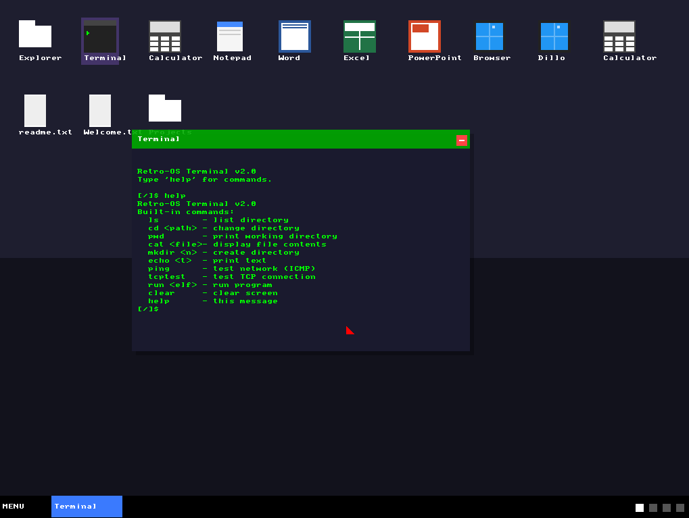
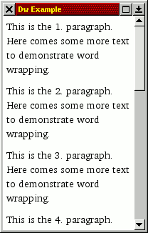
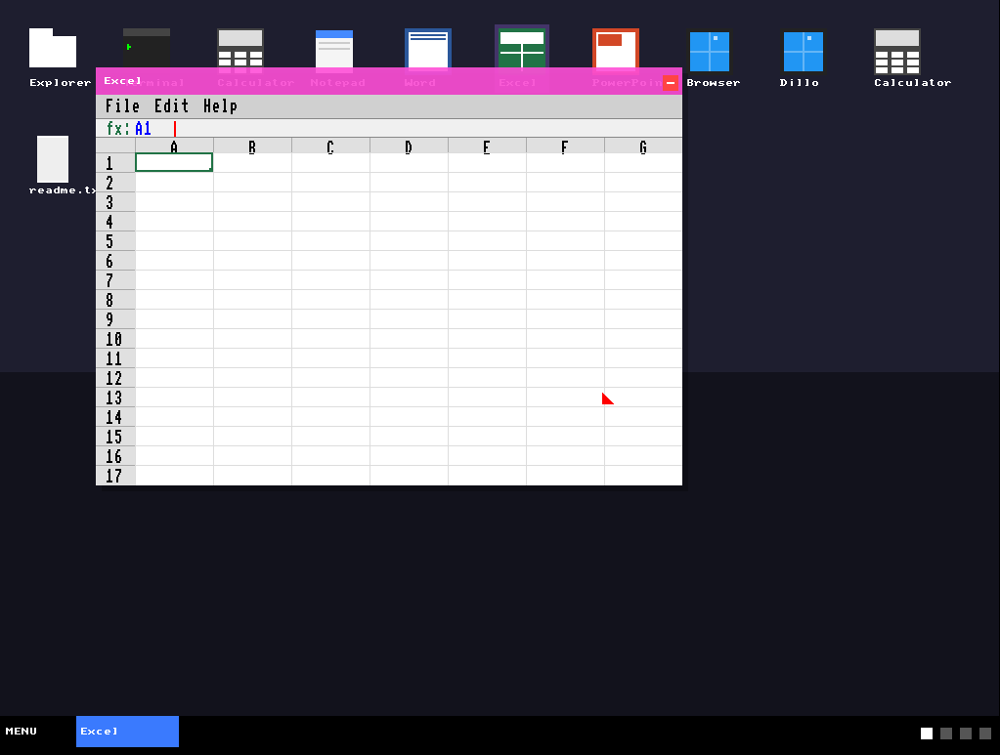
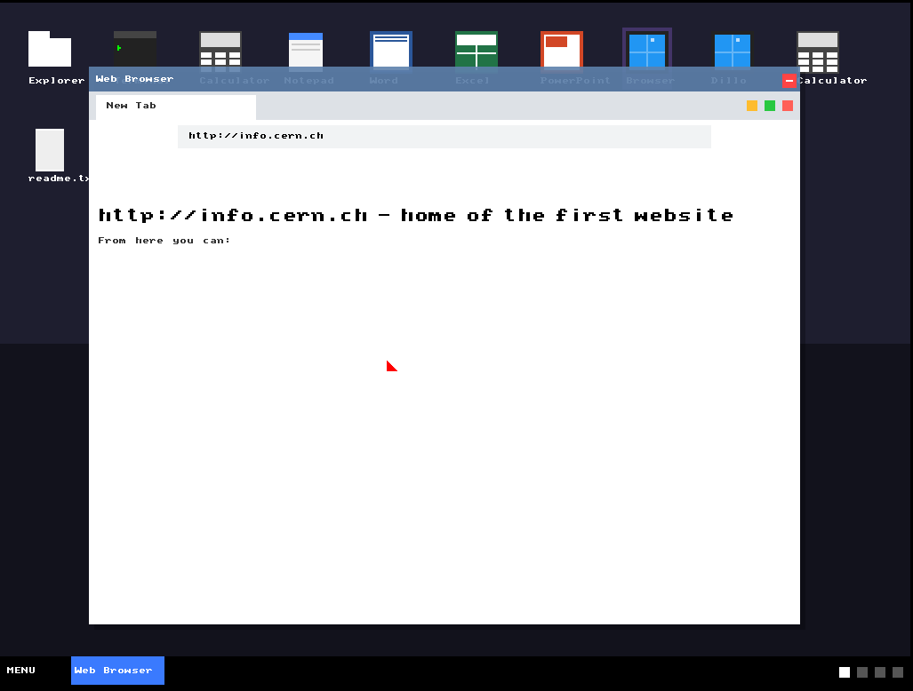

# 🕹️ Retro-OS



**Retro-OS** is a high-performance, higher-half 32-bit Operating System designed with a focus on modern networking, POSIX compliance, and a rich graphical user interface. Built from the ground up, it features a custom kernel, a robust network stack with HTTPS support, and a dedicated rendering engine.

---

## 🚀 Key Features

### 🧠 Core System
- **32-bit Protected Mode**: Fully utilized x86 architecture.
- **Higher-Half Kernel**: Linked at `0xC0000000` for better memory management.
- **Paging & Memory Management**: Unified mapping with support for large memory regions and a sophisticated slab allocator.
- **Multitasking**: Kernel-level threading and user-process isolation.

### 🌐 Networking Stack
- **Modern HTTPS**: Support for SNI (Server Name Indication) and ALPN.
- **TCP/IP Reliability**: Robust sequence tracking and segment reassembly.
- **Hardware Support**: E1000 network driver implementation.
- **Entropy Source**: Jitter-based kernel entropy for secure TLS handshakes.

### 🖥️ Graphics & GUI
- **BGA/VBE Support**: High-resolution 1024x768x32 graphics.
- **Double Buffering**: Smooth, flicker-free rendering.
- **GUI System**: Native windowing system with mouse and keyboard integration.
- **Browser Engine**: Custom HTML5 parser and rendering logic.

### 📜 POSIX Compliance
- **IPC**: Semaphores and Message Queues.
- **Stubs**: Growing support for standard POSIX APIs to enable application porting.
- **Filesystem**: FAT16 integration with a Virtual File System (VFS) layer.

---

## 📸 Demo & Screenshots

Explore the visual identity and interface of Retro-OS.

| Desktop Environment | Development Progress | Rendering Engine |
| :---: | :---: | :---: |
|  |  |  |
|  |  | |

> [!NOTE]
> *Above: Snapshots of the GUI system and the kernel booting into protected mode.*

---

## 🛠️ Building & Running

### Prerequisites
- **WSL** (Windows Subsystem for Linux)
- **g++ (m32 support)**
- **nasm**
- **qemu**

### Build Instructions
To build the OS image:
```powershell
./build.ps1
```
This script triggers the `build.sh` within WSL to compile all components and generate `os.img`.

### Running with QEMU
Run the following command to boot Retro-OS:
```powershell
qemu-system-i386 -drive format=raw,file=os.img -m 2G -serial stdio -net nic,model=e1000 -net user
```

---

## 📂 Project Structure

- `/src/boot`: Bootloader and kernel entry logic.
- `/src/kernel`: Core kernel systems (Paging, Tasking, IPC).
- `/src/drivers`: Hardware drivers (Graphics, Network, Timer).
- `/apps`: Userspace applications.
- `/Demo`: Visual assets and project screenshots.

---

## 🚧 Status & Roadmap
Retro-OS is under active development. Current focus areas include:
- [ ] **MuJS Integration**: Finalizing JavaScript execution in the browser.
- [ ] **Image Decoding**: Native support for PNG/JPEG.
- [ ] **VFS Stability**: Enhancing FAT16 state synchronization.

---
*Created with ❤️ by the Retro-OS Team.*
